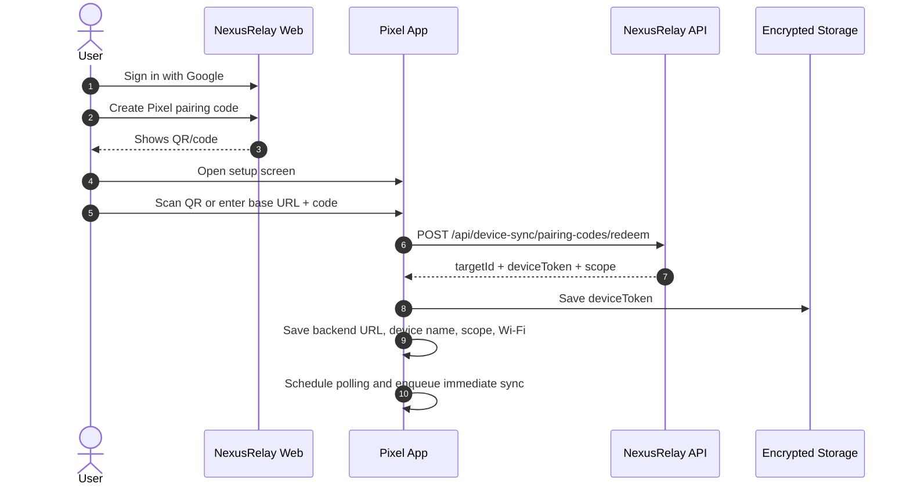

# Pixel Pairing Code Implementation Plan

> REQUIRED SUB-SKILL: Use Superpowers execution style: small tasks, focused tests, preserve existing app behavior, and do not mix UI cleanup with auth transport changes unless required.

**Goal:** Remove username/password account login from the Pixel receiver app. Register Pixel through a short-lived pairing code or QR created by an approved NexusRelay web session. After registration, Pixel keeps using the existing revocable `X-Device-Token` flow for background sync.

**Architecture:** Pixel is a receiver device, not an account client. It should never store Google tokens, NexusRelay account cookies, access JWTs, refresh tokens, or user passwords. The web app creates a pairing code for an approved user and scope. Pixel redeems the code once, receives a `deviceToken`, stores that token in encrypted storage, and all future sync calls continue unchanged.

**Backend dependency:** Backend pairing APIs from `G:/workspace/nexus-relay/docs/superpowers/plans/2026-06-07-google-auth-admin-approval-backend-implementation.md`.

---

## Current Pixel Facts

- Setup screen currently collects backend URL, username, password, device name, Wi-Fi only, sync scope, and optional folder ID.
- Retrofit currently calls `POST api/auth/mobile/login` and then `POST api/device-sync/register` with `Authorization: Bearer <token>`.
- After registration, the app saves:
  - backend URL
  - device name
  - Wi-Fi only
  - target id
  - sync scope
  - scoped folder id
  - raw device token
- Background sync already uses `X-Device-Token`.
- `DeviceTokenStore` uses AndroidX Security encrypted preferences.
- FCM refresh already updates backend through `X-Device-Token`.

This implementation should only replace the registration/auth setup path. Job polling, download, import, confirm, fail, cleanup, and ledger behavior should stay unchanged.

---

## Files In Scope

Modify:

- `android/pixel/app/src/main/java/com/nexusrelay/pixel/api/NexusRelayApi.kt`
- `android/pixel/app/src/main/java/com/nexusrelay/pixel/api/DeviceSyncDtos.kt`
- `android/pixel/app/src/main/java/com/nexusrelay/pixel/ui/SetupScreen.kt`
- `android/pixel/app/src/main/java/com/nexusrelay/pixel/storage/AppSettingsStore.kt`
- `android/pixel/app/src/main/java/com/nexusrelay/pixel/ui/FcmTokenResolver.kt` only if setup orchestration needs minor changes
- `android/pixel/app/src/test/java/com/nexusrelay/pixel/api/DeviceSyncDtoTest.kt`
- Add setup UI/unit tests if practical
- Update `android/pixel/README.md`
- Update `G:/workspace/nexus-relay-mobile/docs/contracts/device-sync-api.md`
- Update `G:/workspace/nexus-relay-mobile/docs/architecture/pixel-companion-sync.md`
- Update `G:/workspace/nexus-relay-mobile/docs/implementation/pixel-manual-verification.md`

Optional:

- Add QR scanning dependency later. First implementation can support manual code entry and QR payload parsing in tests.

---

## API Contract

### Pairing Code QR Payload

QR payload should be small and contain no secrets beyond the short-lived code:

```json
{
  "baseUrl": "https://relay.xuantruong.org",
  "code": "12345678"
}
```

Manual entry should also work with:

```text
base URL + code
```

### Redeem Pairing Code

```http
POST api/device-sync/pairing-codes/redeem
Content-Type: application/json
```

Request:

```json
{
  "code": "12345678",
  "deviceName": "Pixel XL",
  "platform": "Android",
  "fcmToken": "fcm-token-from-firebase"
}
```

Response:

```json
{
  "targetId": "4d6b0f2e-47b6-49fd-8daa-c87e70307f9f",
  "deviceToken": "raw-device-token-returned-once",
  "syncScope": "Folder",
  "scopedFolderId": "2f1cbb66-4a8d-4d62-b14d-67d821742958",
  "wifiOnly": true
}
```

No account bearer token is returned. No Google token is returned. Pixel stores only `deviceToken` plus non-secret settings.

---

## User Flow



Failure states:

- Invalid code: show "Pairing code is invalid."
- Expired code: show "Pairing code expired. Create a new one from NexusRelay."
- Already used code: show "Pairing code already used."
- Network/server failure: show retryable error.
- Missing FCM token: allow registration with null token if backend accepts it, then update token later through existing FCM token update path.

---

## Implementation Tasks

### Task 1: Replace Account Login DTOs With Pairing DTOs

In `DeviceSyncDtos.kt`:

- [ ] Remove `LoginRequest` and `LoginResponse` if no longer used.
- [ ] Add:

```kotlin
@JsonClass(generateAdapter = true)
data class RedeemPairingCodeRequest(
    val code: String,
    val deviceName: String,
    val platform: String = "Android",
    val fcmToken: String?
)

@JsonClass(generateAdapter = true)
data class PairingCodePayload(
    val baseUrl: String,
    val code: String
)
```

- [ ] Extend `RegisterDeviceResponse` or add `RedeemPairingCodeResponse`:

```kotlin
@JsonClass(generateAdapter = true)
data class RedeemPairingCodeResponse(
    val targetId: String,
    val deviceToken: String,
    val syncScope: DeviceSyncScope = DeviceSyncScope.AccountUploads,
    val scopedFolderId: String? = null,
    val wifiOnly: Boolean = true
)
```

Acceptance:

- Moshi parses the backend redeem response.
- Existing `DeviceSyncScope` enum remains compatible.

### Task 2: Update Retrofit API

In `NexusRelayApi.kt`:

- [ ] Remove or mark legacy:

```kotlin
@POST("api/auth/mobile/login")
suspend fun login(...)

@POST("api/device-sync/register")
suspend fun registerDevice(@Header("Authorization") authorization: String, ...)
```

- [ ] Add:

```kotlin
@POST("api/device-sync/pairing-codes/redeem")
suspend fun redeemPairingCode(
    @Body request: RedeemPairingCodeRequest
): RedeemPairingCodeResponse
```

- [ ] Keep all job endpoints unchanged.
- [ ] Keep `updateFcmToken` unchanged.

Tests:

- [ ] Reflection test asserts no setup path depends on `api/auth/mobile/login`.
- [ ] Contract test asserts endpoint value is `api/device-sync/pairing-codes/redeem`.

### Task 3: Parse QR Payloads

Create a small pure helper, for example:

```text
PairingCodeParser.parse(text): PairingCodePayload?
```

Rules:

- Accept JSON payload with `baseUrl` and `code`.
- Accept plain code only when backend URL field is visible/populated.
- Trim spaces.
- Reject empty code.
- Normalize backend URL through existing `ApiClientFactory` expectations.

Tests:

- [ ] Parses JSON QR payload.
- [ ] Parses manual code.
- [ ] Rejects malformed JSON.
- [ ] Rejects missing baseUrl when URL field is hidden and no saved backend URL exists.

### Task 4: Redesign Setup Screen Behavior

Setup fields:

- Backend URL: visible only when `BuildConfig.SHOW_BACKEND_URL_FIELD` is true or QR payload lacks baseUrl.
- Pairing code: visible manual entry field.
- Device name.
- Optional scan QR button if scanner is implemented in this phase.

Remove fields:

- Username.
- Password.
- Sync scope segmented control.
- Folder ID input.

Why remove scope fields:

- Scope is selected on web when the pairing code is created.
- Backend returns the accepted scope in redeem response.
- Pixel stores and displays scope but does not decide it.

Submit behavior:

```text
validate backend URL, code, deviceName
create API client
resolve FCM token
POST redeemPairingCode
save backend URL, deviceName, wifiOnly, targetId, scope, folder, deviceToken
schedule polling
enqueue one-time sync
transition to status screen
```

Acceptance:

- User can pair with manual code.
- Username/password no longer appear in UI.
- Scope displayed after registration comes from backend response.
- Existing unregister flow still clears token/settings and returns to setup.

### Task 5: Settings Persistence

`AppSettingsStore` already supports:

- backend URL
- target ID
- device name
- Wi-Fi only
- FCM token
- sync scope
- scoped folder id

Changes:

- [ ] Use `response.wifiOnly` from backend if included; otherwise keep local default.
- [ ] Save `response.syncScope.name`.
- [ ] Save `response.scopedFolderId`.
- [ ] Clear any legacy account fields if they were ever added. Current app has no persisted username/password.

Acceptance:

- No password/token material except device token is persisted.
- Device token remains in `DeviceTokenStore`.

### Task 6: QR Scanner Option

First implementation can skip camera scanning and support manual code only. If QR is included now:

- [ ] Use a maintained AndroidX/ML Kit scanner or CameraX + ML Kit barcode scanning.
- [ ] Request camera permission only for scan action.
- [ ] Do not request broad storage permissions.
- [ ] On scan, parse payload and prefill backend URL/code.

Recommended first pass:

- Manual code entry now.
- QR scan follow-up after backend and manual pairing are verified.

### Task 7: Update Status And Settings Copy

Replace text:

- "Use your NexusRelay account once..." with "Create a pairing code from NexusRelay, then enter it here."
- "Register Pixel" can become "Pair Pixel".
- Error "Server, account, and device name are required" becomes "Server, pairing code, and device name are required."

Keep:

- Sync tab.
- Ledger tab.
- Settings tab.
- FCM status.
- Cleanup space.
- Unregister.

### Task 8: Tests

Run:

```powershell
Set-Location G:/workspace/nexus-relay-mobile/android/pixel
./gradlew test
```

Focused tests to add/update:

- DTO parses pairing redeem response.
- Retrofit endpoint points to pairing redeem.
- Setup validation rejects missing code.
- Pairing parser handles JSON QR payload.
- Existing sync repository tests still pass because `X-Device-Token` paths are unchanged.

### Task 9: Manual Verification

Prereqs:

- Backend deployed with pairing-code endpoints.
- Web app can create pairing codes from approved Google session.

Scenario 1: Pair manually

1. Sign in to NexusRelay web with Google as approved user.
2. Create Pixel pairing code with AccountUploads scope.
3. Open Pixel app fresh.
4. Enter backend URL, code, and device name.
5. Tap Pair Pixel.
6. Confirm app reaches status screen.
7. Confirm backend has one enabled target.

Scenario 2: Sync after pairing

1. Upload media from that account.
2. Tap Sync Now or wait for FCM/polling.
3. Confirm media imports into MediaStore.
4. Confirm backend marks job `ImportedConfirmed`.

Scenario 3: Invalid/reused code

1. Redeem a code once successfully.
2. Clear app and try the same code.
3. Confirm user-facing error says code is already used or invalid.

Scenario 4: Folder scope

1. Create pairing code with Folder scope.
2. Pair Pixel.
3. Upload to matching folder and confirm job arrives.
4. Upload to other folder and confirm no job arrives.

---

## Documentation Updates

Update `android/pixel/README.md`:

- Setup uses pairing code/QR.
- Password is no longer entered on Pixel.
- Pixel stores device token only.

Update shared mobile docs:

- `docs/contracts/device-sync-api.md`: add pairing-code redeem endpoint.
- `docs/architecture/pixel-companion-sync.md`: replace "user login or pairing token" with pairing-code flow.
- `docs/implementation/pixel-manual-verification.md`: update registration steps.

---

## Acceptance Checklist

- Pixel setup no longer has username/password fields.
- Pixel no longer calls `/api/auth/mobile/login`.
- Pixel no longer sends `Authorization: Bearer <user-access-token>` for registration.
- Pixel can redeem a pairing code and store `deviceToken`.
- Existing sync endpoints still use `X-Device-Token`.
- Pixel stores no Google/NexusRelay account session.
- Existing background sync, FCM, polling, ledger, import, confirm, cleanup, and unregister behavior remains intact.

