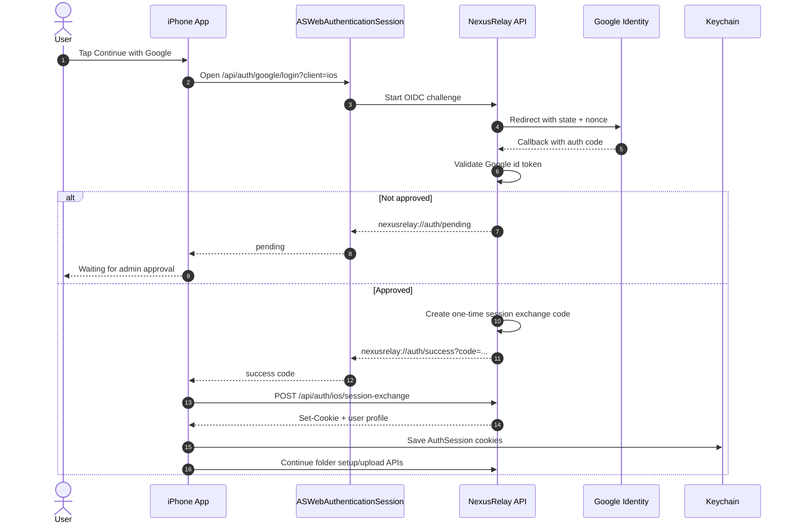

# iOS Google Auth Implementation Plan

> REQUIRED SUB-SKILL: Use Superpowers execution style: preserve the existing uploader pipeline, change auth in small verified steps, and keep tests focused on session handling before touching upload orchestration.

**Goal:** Replace iOS username/password setup with Google sign-in through the system browser. After Admin approval, the iPhone app exchanges a one-time backend code for NexusRelay cookies/session material, stores that session in Keychain, and continues using the existing cookie + CSRF upload APIs.

**Architecture:** iOS is an account uploader client, unlike Pixel. It should sign in with Google directly because it creates folders, uploads media, refreshes account sessions, and reconciles uploaded media. The app must not receive or store Google tokens. Google auth completes in `ASWebAuthenticationSession`; the backend redirects to the app with a short-lived one-time session exchange code; the app posts the code to the backend and receives NexusRelay cookies in its own `URLSession` cookie jar.

**Backend dependency:** `POST /api/auth/ios/session-exchange` from `G:/workspace/nexus-relay/docs/superpowers/plans/2026-06-07-google-auth-admin-approval-backend-implementation.md`.

---

## Current iOS Facts

- `SetupView` currently asks for server, username, and password.
- `SetupViewModel.saveAndLogin()` currently calls `apiClient.login(username:password:)`.
- `SystemNexusRelayAPIClient.login(...)` posts to `api/auth/login`, captures `Set-Cookie`, creates `AuthSession`, and saves it.
- `CookieSessionStore` persists `AuthSession` in Keychain.
- `AuthSession` stores user id, username, role, and cookies.
- `SystemHTTPClient` and `SystemCSRFTokenProvider` already support cookie + CSRF authenticated API calls.
- Upload engine, folder creation, reconciliation, and background work already depend on an authenticated NexusRelay API client.

This implementation should replace login/session bootstrap only. Folder setup, Photos permission, upload ledger, export, upload, reconciliation, and queue UI should remain structurally intact.

---

## iOS Auth Flow



Why session exchange is needed:

- `ASWebAuthenticationSession` protects Google credentials.
- The browser auth context should not be treated as the app API cookie jar.
- The deep link carries only a short-lived one-time code, not JWTs, refresh tokens, Google tokens, or device tokens.
- The app receives real NexusRelay cookies through its own API request, so existing `CookieSessionStore` remains useful.

---

## Files In Scope

Modify:

- `ios/iphone/NexusRelayIPhone/Core/API/APIModels.swift`
- `ios/iphone/NexusRelayIPhone/Core/API/NexusRelayAPIClient.swift`
- `ios/iphone/NexusRelayIPhone/Core/Auth/AuthSession.swift`
- `ios/iphone/NexusRelayIPhone/Core/Auth/CookieSessionStore.swift` only if metadata changes require it
- `ios/iphone/NexusRelayIPhone/Core/Auth/CSRFTokenProvider.swift` only if token clearing behavior changes
- `ios/iphone/NexusRelayIPhone/Features/Setup/SetupView.swift`
- `ios/iphone/NexusRelayIPhone/Features/Setup/SetupViewModel.swift`
- `ios/iphone/NexusRelayIPhone/Features/Setup/SetupChecklistModels.swift`
- `ios/iphone/NexusRelayIPhone/Features/Setup/SetupChecklistView.swift`
- `ios/iphone/NexusRelayIPhone/Features/Settings/SettingsView.swift`
- `ios/iphone/NexusRelayIPhone/Features/Settings/SettingsViewModel.swift`
- `ios/iphone/NexusRelayIPhone/Resources/Info.plist`
- `ios/iphone/project.yml`
- `ios/iphone/README.md`
- `ios/iphone/docs/manual-verification.md`

Create:

- `ios/iphone/NexusRelayIPhone/Core/Auth/GoogleAuthCoordinator.swift`
- `ios/iphone/NexusRelayIPhone/Core/Auth/AuthCallbackURL.swift`
- Tests under `ios/iphone/NexusRelayIPhoneTests/Auth`
- Tests under `ios/iphone/NexusRelayIPhoneTests/API`
- Setup view model tests for pending/success/failure if test harness supports injection

---

## Backend Contract

### Start Google Login

The app opens the backend URL in `ASWebAuthenticationSession`:

```text
GET {baseUrl}/api/auth/google/login?client=ios&returnUrl=nexusrelay://auth/success
```

The backend decides final redirect:

```text
nexusrelay://auth/success?code=<one-time-session-exchange-code>
nexusrelay://auth/pending
nexusrelay://auth/denied?reason=<short-code>
```

### Exchange Session Code

```http
POST /api/auth/ios/session-exchange
Content-Type: application/json
X-NexusRelay-CSRF: optional/not required if backend exempts this endpoint
```

Request:

```json
{
  "code": "one-time-session-exchange-code"
}
```

Response body:

```json
{
  "id": "31b2...",
  "username": "xuan",
  "email": "xuan@example.com",
  "role": "User",
  "authProvider": "Google"
}
```

Response headers:

```text
Set-Cookie: access_token=...; HttpOnly; Secure; SameSite=...
Set-Cookie: refresh_token=...; HttpOnly; Secure; SameSite=...
```

The app captures those cookies the same way the current password login captures cookies.

---

## Implementation Tasks

### Task 1: Update URL Scheme

In `project.yml` and generated `Info.plist`:

- [ ] Add custom URL scheme:

```text
nexusrelay
```

- [ ] Ensure callback URLs:

```text
nexusrelay://auth/success
nexusrelay://auth/pending
nexusrelay://auth/denied
```

Acceptance:

- `ASWebAuthenticationSession` can complete through the custom callback scheme.
- App can parse callback URL in tests without launching UI.

### Task 2: Add Auth Callback Parser

Create `AuthCallbackURL.swift`:

```swift
enum AuthCallbackResult: Equatable {
    case success(code: String)
    case pending
    case denied(reason: String?)
    case invalid
}
```

Rules:

- Host/path must represent auth callback.
- `success` requires non-empty `code`.
- `pending` has no code.
- `denied` can include reason.
- Unknown URLs are invalid.

Tests:

- [ ] Parses success URL with code.
- [ ] Parses pending URL.
- [ ] Parses denied URL.
- [ ] Rejects wrong scheme/host/missing code.

### Task 3: Add Google Auth Coordinator

Create `GoogleAuthCoordinator`:

Responsibilities:

- Build login URL from saved base URL:

```text
{baseUrl}/api/auth/google/login?client=ios
```

- Start `ASWebAuthenticationSession`.
- Use callback scheme `nexusrelay`.
- Parse callback URL through `AuthCallbackURL`.
- Return `AuthCallbackResult`.

Design for testability:

- Wrap `ASWebAuthenticationSession` behind protocol:

```swift
protocol WebAuthenticationSession {
    func start(url: URL, callbackScheme: String) async throws -> URL
}
```

- Production implementation uses `ASWebAuthenticationSession`.
- Tests use fake session returning callback URL.

Acceptance:

- Google credentials are never collected in SwiftUI fields.
- The app receives only callback URL state.

### Task 4: Add Session Exchange API

In `APIModels.swift`:

```swift
struct IosSessionExchangeRequest: Encodable {
    let code: String
}

struct CurrentUserResponse: Codable, Equatable {
    let id: UUID
    let username: String
    let email: String?
    let role: String
    let authProvider: String?
}
```

`BrowserAuthResponse` can be extended instead of adding `CurrentUserResponse` if simpler.

In `NexusRelayAPI` protocol:

```swift
func exchangeIosSession(code: String) async throws -> AuthSession
```

In `SystemNexusRelayAPIClient`:

- [ ] POST `api/auth/ios/session-exchange`.
- [ ] Accept 200.
- [ ] Decode user response.
- [ ] Extract response cookies using existing `cookies(from:for:)`.
- [ ] Fall back to `HTTPCookieStorage.shared.cookies(for:)` only if needed.
- [ ] Save `AuthSession`.

Important:

- Do not add Google token fields.
- Do not store the one-time exchange code after success.
- Clear CSRF token cache after session exchange so later unsafe calls fetch fresh CSRF for the new session.

Tests:

- [ ] Exchange saves cookies from response headers.
- [ ] Exchange rejects missing cookies.
- [ ] Exchange rejects non-200.
- [ ] Exchange decodes auth provider.

### Task 5: Replace Password Login API Usage

Deprecate:

```swift
func login(username: String, password: String) async throws -> AuthSession
```

Options:

- Remove it if all callers migrate in one change.
- Keep it as LocalAdmin-only internal fallback if needed, but do not expose in setup UI.

Setup should call:

```text
GoogleAuthCoordinator.signIn(baseURL)
api.exchangeIosSession(code)
api.currentUser()
```

Acceptance:

- No setup path posts username/password.
- No password field remains in normal setup UI.

### Task 6: Update Setup View

Fields:

- Server URL.
- Wi-Fi Only.
- Include Videos.
- Live Photo Video.
- Destination folder name if already exposed by the app.

Remove:

- Username.
- Password.

Primary action:

```text
Continue with Google
```

Copy:

- Replace "Password is not stored after login..." with "Google sign-in opens in the system browser. NexusRelay stores only its own session cookies."

Pending state:

- If callback is `pending`, set `errorMessage` or separate `approvalMessage`:

```text
Access request sent. An admin must approve this Google account before uploads can start.
```

Denied state:

- Show backend-provided denial reason if safe.

Success path:

- Save server settings.
- Run Google auth.
- Exchange session code.
- Create/find destination folder.
- Request Photos permission.
- Mark setup complete.

Acceptance:

- Existing folder setup still happens after auth.
- Existing Photos permission setup still happens after auth.
- User can retry Google sign-in after approval.

### Task 7: Update Setup Checklist

Current checklist depends on username. Replace with:

- Server URL.
- Google sign-in.
- Photos access.
- Destination folder.

Tests:

- [ ] Checklist no longer requires username.
- [ ] Checklist shows signed-in state from `AuthSession`.
- [ ] Pending approval is represented as not complete.

### Task 8: Update Auth Session Metadata

Extend `AuthSession` if useful:

```swift
let email: String?
let authProvider: String?
```

Keep backward compatibility:

- Decode older stored sessions without email/authProvider if possible, or clear old sessions on decode failure.
- Current `CookieSessionStore.loadSession()` already returns nil on decode failure, which is acceptable for an auth migration if documented.

Acceptance:

- Settings screen can show signed-in email/provider.
- Google-backed session can display "Signed in with Google."

### Task 9: Logout And Session Expiry

Existing logout/settings flow should:

- [ ] Call backend `POST /api/auth/logout` if available in client.
- [ ] Clear `CookieSessionStore`.
- [ ] Clear CSRF provider.
- [ ] Keep or clear app settings based on current UX decision.

Refresh behavior:

- Existing `SystemHTTPClient` should refresh on 401 if already implemented.
- If refresh fails, pause uploads and show sign-in required.
- Sign-in required should route user back to Google setup flow.

### Task 10: Tests

Commands:

```powershell
Set-Location G:/workspace/nexus-relay-mobile/ios/iphone
xcodebuild test -scheme NexusRelayIPhone -destination "platform=iOS Simulator,name=iPhone 16"
```

If local simulator name differs, use the existing repo command from `README.md`.

Focused tests:

- `AuthCallbackURLTests`
- `GoogleAuthCoordinatorTests` with fake web session
- `NexusRelayAPIClientTests.exchangeIosSession...`
- `SetupChecklistModelTests` updated for Google sign-in
- `SetupViewModelTests` for success/pending/denied if dependency injection allows
- Existing upload tests unchanged

### Task 11: Manual Verification

Scenario 1: Pending user

1. Install iOS app fresh.
2. Enter backend URL.
3. Tap Continue with Google.
4. Use a Google account not approved in NexusRelay.
5. Confirm app shows waiting-for-approval.
6. Confirm backend pending users list includes that Google account.

Scenario 2: Approved upload setup

1. Admin approves the pending user.
2. Retry Continue with Google.
3. Confirm app returns to setup and completes session exchange.
4. Confirm destination folder is created/found.
5. Confirm Photos permission flow works.
6. Confirm setup transitions to app shell.

Scenario 3: Upload still works

1. Run manual sync with one small image.
2. Confirm stream upload path succeeds.
3. Run manual sync with one large video.
4. Confirm chunked upload path succeeds.
5. Confirm media appears in NexusRelay web.

Scenario 4: Session expiry

1. Expire or clear cookies server-side.
2. Trigger sync.
3. Confirm refresh or sign-in-required state.
4. Re-run Google sign-in and resume.

---

## Documentation Updates

Update `ios/iphone/README.md`:

- Setup uses Google sign-in.
- The app opens the system browser.
- The app stores NexusRelay cookies in Keychain.
- The app never stores user password or Google tokens.

Update `ios/iphone/docs/manual-verification.md`:

- Replace username/password setup steps.
- Add pending approval scenario.
- Add session exchange smoke test.

Update shared mobile docs if needed:

- `docs/superpowers/plans/2026-06-05-ios-photos-uploader-current-docs.md` can be superseded by this plan.

---

## Acceptance Checklist

- iOS setup has no username/password fields.
- iOS uses `ASWebAuthenticationSession` for Google sign-in.
- Deep link contains only one-time session exchange code.
- iOS exchanges code through backend and captures NexusRelay cookies in app `URLSession`.
- Session cookies are persisted in Keychain through existing `CookieSessionStore`.
- CSRF remains attached to unsafe account/upload requests.
- iOS never stores Google tokens.
- Pending approval is handled clearly.
- Existing folder setup, Photos permission, upload ledger, upload engine, reconciliation, and queue flows remain working.

